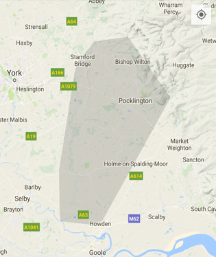

# Kortið tól
[](https://jitpack.io/#fiskurgit/KortidTol) [](https://travis-ci.org/fiskurgit/KortidTol) [](https://github.com/fiskurgit/KortidTol/blob/master/LICENSE) [](https://www.codacy.com/app/fiskur/KortidTol?utm_source=github.com&amp;utm_medium=referral&amp;utm_content=fiskurgit/KortidTol&amp;utm_campaign=Badge_Grade)

Map tools for GoogleMaps on Android, developed for the [Yorkshire 3 Peaks app](https://play.google.com/store/apps/details?id=eu.fiskur.yorkshirethreepeaks).

##Dependency

Add jitpack.io to your root build.gradle, eg:

```groovy
allprojects {
    repositories {
        jcenter()
        maven { url "https://jitpack.io" }
    }
}
```

then add the dependency to your project build.gradle:

```groovy
dependencies {
    compile fileTree(dir: 'libs', include: ['*.jar'])
    compile 'com.github.fiskurgit:KortidTol:1.0.1'
}
```
You can find the latest version in the releases tab above: https://github.com/fiskurgit/KortidTol/releases

More options at jitpack.io: https://jitpack.io/#fiskurgit/KortidTol

##Licence

Full licence here: https://github.com/fiskurgit/KortidTol/blob/master/LICENSE

In short:

> The MIT License is a permissive license that is short and to the point. It lets people do anything they want with your code as long as they provide attribution back to you and don’t hold you liable.

##Limit Bounds

Limit the map to displaying a specific area, prevents the user scrolling away, useful if your app is local/location specific:

```java
map.setOnCameraChangeListener(new GoogleMap.OnCameraChangeListener() {
  @Override public void onCameraChange(CameraPosition cameraPosition) {
    MapTools.limitBounds(map, cameraPosition, threePeaksBounds, MIN_ZOOM);
  }
});
```

##Create Bounds

Either provide four outlier coordinates or an array of LatLng pairs and return a bounding box LatLngBounds object:

```java
LatLngBounds threePeaksBounds = MapTools.createBounds(MIN_LAT, MAX_LAT, MIN_LON, MAX_LON);

//or

LatLng[] multipleCoords = ...
LatLngBounds threePeaksBounds = MapTools.createBounds(multipleCoords);
```

##Nearest Index

Find the nearest index in an array of coordinates to a point, for example when a user long-clicks on a map near a route, find the nearest point on the route:

```java
map.setOnMapLongClickListener(new GoogleMap.OnMapLongClickListener() {
  @Override public void onMapLongClick(LatLng latLng) {
    int nearestIndex = MapTools.nearestIndex(routeCoords, latLng);
    LatLng nearestRoutePoint = routeCoords.get(nearestIndex);
  }
});
```

##Long Click Helper and Draw Subsection

Manage long-click events with a map to help draw a route subsection.

```java
LongClickHelper longClickHelper = new LongClickHelper();

...

map.setOnMapLongClickListener(new GoogleMap.OnMapLongClickListener() {
  @Override public void onMapLongClick(LatLng latLng) {
    vibrator.vibrate(175);
    longClickHelper.addPoint(latLng);
    if(longClickHelper.isReady()){
      LatLng startClick = longClickHelper.getStart();
      LatLng endClick = longClickHelper.getEnd();
      MapTools.drawSubsection(map, routeCoords, startClick, endClick, Color.parseColor("#ff00cc"));
    }
  }
});
```

##Subsection Distance

Calculate the distance of a subsection of a route

```java
float meters = MapTools.subsectionDistance(routeCoords, startCoord, endCoord);
```

##Quick Hull



There's a [Quick Hull](https://en.wikipedia.org/wiki/Quickhull) implementation included (written by [Jared Rummler](http://jaredrummler.com/2014/11/13/android-bitmaps-convex-hull/)) which can be used for displaying the bounding shape of GeoJson polygons. Rather than expensive rendering of a shape consisting of thousands of points follow the steps below, you have to go round the houses a little, converting to points and back, I'll try and find time to convert the method so it can be done in a single pass at some point ([more detail here](http://fiskur.eu/markdown/2015-11-13-getting-a-convex-hull-from-geojson.md)):

```java
List<LatLng> polygonPoints = MapTools.getPoints(jsonString);
QuickHull quickHull = new QuickHull();
ArrayList<Point> points = quickHull.convertToPoint(polygonPoints, map.getProjection());
ArrayList<Point> hull = quickHull.quickHull(points);
ArrayList<LatLng> hullLatLng = quickHull.convertToLatLng(hull, map.getProjection());
Polygon hullPolygon = map.addPolygon(new PolygonOptions()
  .addAll(hullLatLng)
  .strokeColor(Color.parseColor("#22000000"))
  .strokeWidth(0)
  .fillColor(Color.parseColor("#22000000")));
}

```
